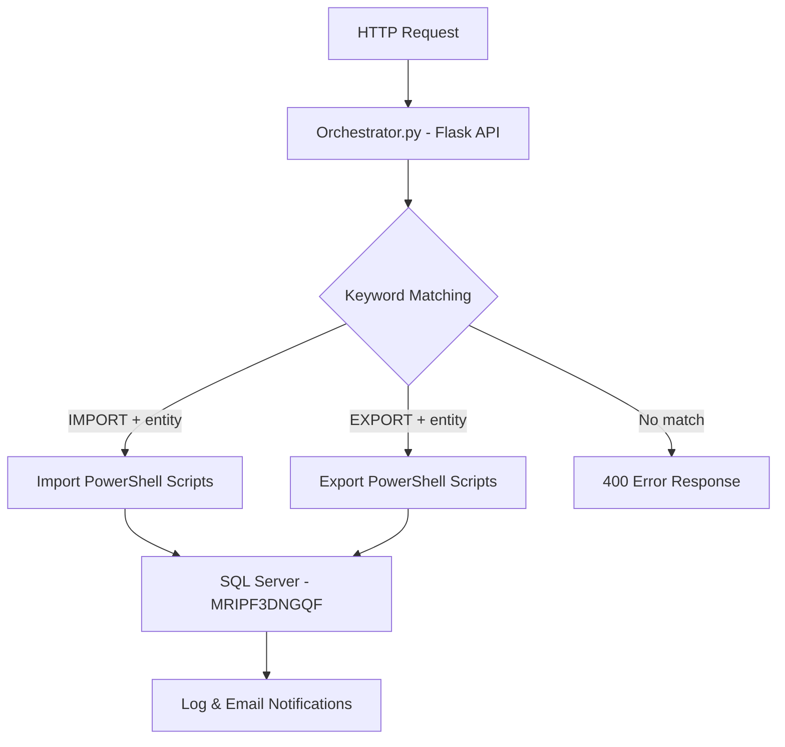

# CoPilotDCA (Data Cleanup Agent)

Enterprise DataOps automation framework using Python, PowerShell, and SQL Server. Modular ETL, import/export, cleanup, validation, and orchestration pipelines triggered through keyword-based intent routing via a Flask API. Powered by predefined execution workflows and scalable automation architecture.

---

## Table of Contents

- [Architecture Overview](#architecture-overview)
- [Project Structure](#project-structure)
- [Getting Started](#getting-started)
- [API Endpoints](#api-endpoints)
- [Script Registry](#script-registry)
- [Configuration](#configuration)
- [Logging & Notifications](#logging--notifications)

---

## Architecture Overview



The system uses a keyword-based intent routing pattern:

1. An HTTP POST request containing a natural-language prompt is sent to the Flask API.
2. `Orchestrator.py` matches keywords in the prompt to a registered PowerShell script.
3. The matched script is executed, performing the ETL operation against SQL Server.
4. Results (stdout/stderr) are returned as JSON to the caller.

---

## Project Structure

```
CoPilotDCA/
├── Orchestrator.py            # Main Flask API with keyword-based script routing
├── app.py                     # Secondary Flask API for direct SQL script execution
├── CoPilotDCA_StartUP.bat     # Startup script (Flask + ngrok tunnel)
├── Test.ps1                   # SQL Server job monitoring dashboard (web UI)
├── IMPORT/                    # Import pipeline scripts
│   ├── Import_Area.ps1        # Commercial unit area data import
│   ├── Import_Contact.ps1     # Contact data import
│   └── Import_Lease.ps1       # Lease data import
├── EXPORT/                    # Export pipeline scripts
│   ├── Export_Contact.ps1     # Contact data export
│   ├── Export_PMFull.ps1      # PM full data export
│   ├── Export_TRFull.ps1      # TR full data export
│   └── SQLExportScripts/      # SQL query files for exports
│       ├── Contact.sql
│       ├── PMFull.sql
│       └── TRFull.sql
└── DOCS/                      # Technical specifications
    └── Import_Area_TechnicalSpec.md
```

---

## Getting Started

### Prerequisites

- **Python 3.x** with Flask (`pip install flask`)
- **PowerShell 5.1+** with the `SqlServer` module
- **SQL Server** accessible via Windows Authentication
- **ngrok** (optional, for external tunnel access)

### Running the Application

**Option 1 — Startup script (recommended):**

```bat
CoPilotDCA_StartUP.bat
```

This launches the Flask API on port 5000 and opens an ngrok tunnel.

**Option 2 — Manual start:**

```bash
python Orchestrator.py
```

The API will be available at `http://localhost:5000`.

---

## API Endpoints

### `POST /run` — Orchestrator (keyword routing)

Matches keywords in a prompt to a registered script and executes it.

**Request:**

```json
{
  "prompt": "IMPORT AREA"
}
```

**Response (success):**

```json
{
  "success": true,
  "script": "C:\\CopilotDCA\\Repo\\IMPORT\\Import_Area.ps1",
  "output": "...",
  "errors": ""
}
```

**Response (no match):**

```json
{
  "error": "No matching script found"
}
```

### `POST /run-sql` — Direct SQL execution

Executes a SQL script file on a specified server and database.

**Request:**

```json
{
  "server": "MRIPF3DNGQF",
  "database": "v3_common",
  "script": "C:\\path\\to\\script.sql"
}
```

**Response:**

```json
{
  "success": true,
  "output": "...",
  "error": ""
}
```

---

## Script Registry

The `SCRIPTS` list in `Orchestrator.py` maps keyword combinations to PowerShell scripts. Matching is case-insensitive and requires **all** keywords to be present in the prompt.

| Keywords | Script |
|---|---|
| `IMPORT` + `AREA` | `IMPORT\Import_Area.ps1` |
| `IMPORT` + `CONTACT` | `IMPORT\Import_Contact.ps1` |
| `IMPORT` + `LEASE` | `IMPORT\Import_Lease.ps1` |
| `EXPORT` + `CONTACT` | `EXPORT\Export_Contact.ps1` |
| `EXPORT` + `PMFULL` | `EXPORT\Export_PMFull.ps1` |
| `EXPORT` + `TRFULL` | `EXPORT\Export_TRFull.ps1` |

To add a new script, append an entry to the `SCRIPTS` list with the required keyword array and script path.

---

## Configuration

| Setting | Value | Location |
|---|---|---|
| Flask port | `5000` | `Orchestrator.py`, `app.py` |
| SQL Server | `MRIPF3DNGQF` | Import/Export scripts |
| Log file | `C:\CopilotDCA\Repo\IMPORT\log.log` | Import scripts |
| Client log | `C:\CopilotDCA\Repo\IMPORT\Client_log.txt` | Import scripts |
| Archive path | `C:\CopilotDCA\Repo\IMPORT\Archive\` | Import scripts |
| Email profile | `SQL_DBMAIL` | Import scripts |

---

## Logging & Notifications

Import scripts implement a dual-logging pattern:

- **`log.log`** — Detailed timestamped technical logs for the DBA team.
- **`Client_log.txt`** — User-friendly messages mapped from error contexts (see `Write-ClientLog` in import scripts).

On failure, email notifications are sent via:

1. **DBA team** — via `sqlcmd` using `SQL_job_Email_Notification.sql`
2. **Client** — via `msdb.dbo.sp_send_dbmail` with `Client_log.txt` attached
